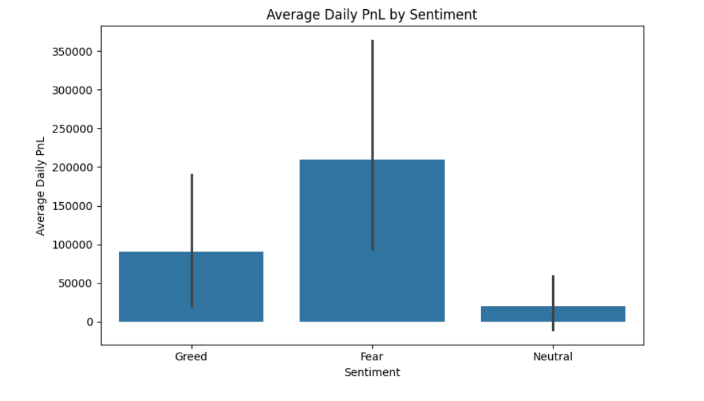
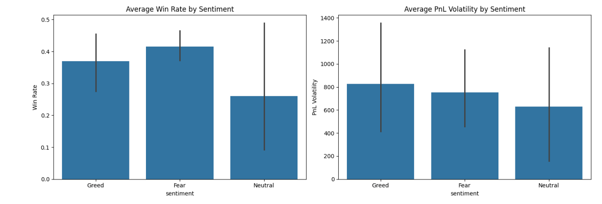
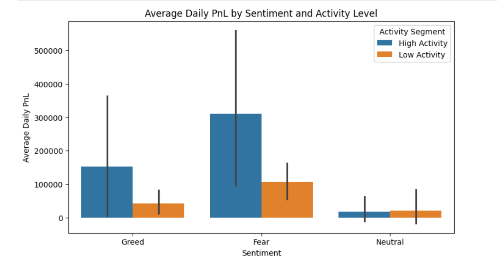
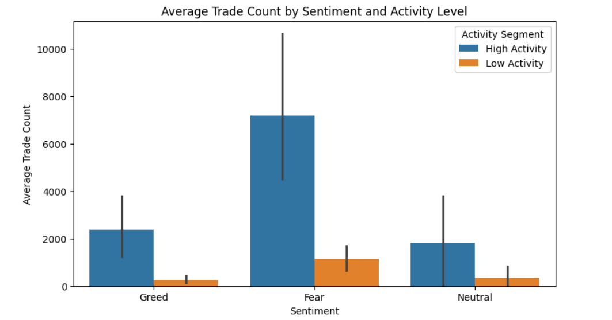
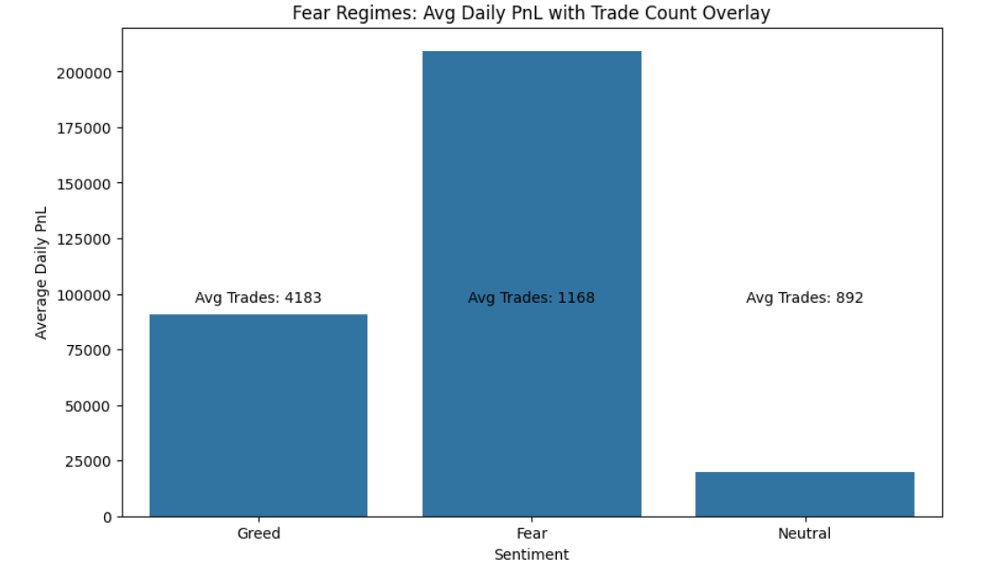
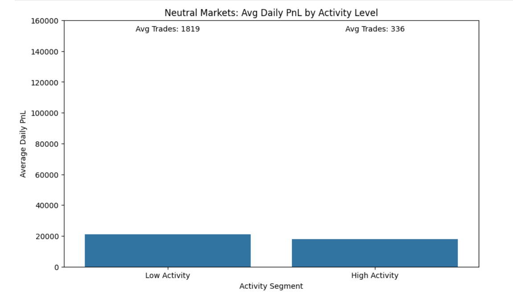

# SENTIMENT-BASED TRADING ANALYSIS 

This project analyzes how market sentiment impacts trader performance using historical trading and sentiment data. The goal is to quantify performance differences across **Fear, Greed, and Neutral** sentiment regimes, and to identify actionable trading strategy rules.

 

## 📊 Sentiment Summary Table

| Metric                | Fear        | Greed       | Neutral      |
|-----------------------|------------|------------|-------------|
| Avg Daily PnL         | 209,373    | 90,989     | 19,843      |
| Median Daily PnL      | 81,390     | 20,926     | -0.42       |
| Avg Win Rate          | 41.6%      | 36.9%      | 26.1%       |
| Avg Volatility        | 753        | 826        | 628         |
| Avg Trade Count       | 4,183      | 1,169      | 893         |

 

## 🔹 Insight 1 — Performance Asymmetry Across Sentiment Regimes
 

### Quantified Observation

- Fear avg PnL (209,373) was:
  - **+130% higher than Greed**
  - **+955% higher than Neutral**
- Win rate:
  - Fear: 41.6%
  - Greed: 36.9%
  - Neutral: 26.1%
- Volatility:
  - Fear volatility was **20% higher than Neutral**

### Interpretation

Fear regimes produced the highest profitability and highest win rate, but with elevated volatility.  
Returns increased substantially, but so did variance.

### Strategy Rule

- Increase capital allocation during Fear regimes.
- Use volatility-adjusted position sizing.
- Cap leverage to control drawdown risk.

### Risk Note

Higher volatility implies larger tail risk exposure.  
Returns are attractive but not stable.

 

## 🔹 Insight 2 — Trading Activity Magnifies Edge
 

### Quantified Observation

High Activity vs Low Activity Performance:

- Fear:
  - High Activity Avg PnL: 324,428
  - Low Activity Avg PnL: 94,317 → **+244% improvement**
- Greed:
  - High Activity Avg PnL: 142,173
  - Low Activity Avg PnL: 42,498 → **+234% improvement**
- Neutral:
  - High Activity Avg PnL: 6,867
  - Low Activity Avg PnL: 32,818 → High activity underperformed by **-79%**

### Interpretation

Activity amplifies profitability during emotional regimes (Fear & Greed).  
However, in Neutral markets, higher activity destroys returns.

### Strategy Rule

- Fear → Increase trade frequency
- Greed → Maintain baseline
- Neutral → Reduce trades by 50–70%

### Risk Note

Overtrading in directionless regimes erodes capital via noise exposure.

 

## 🔹 Insight 3 — Fear Regime Offers Highest Alpha with Higher Risk
 

### Quantified Observation

- Fear avg PnL:
  - 2.3x Greed
  - 10.5x Neutral
- Trade count increased by **+368% vs Neutral**
- Volatility increased by ~20%

### Interpretation

Fear creates dislocation opportunities that active traders exploit.  
However, higher trade count + higher volatility increases downside exposure.

### Strategy Rule

- Enter contrarian positions during Fear
- Restrict leverage
- Apply stricter stop-loss thresholds

### Risk Note

Higher opportunity comes with elevated variance and possible sharp drawdowns.

 

## 🔹 Insight 4 — Neutral Markets Penalize Aggression

 

### Quantified Observation

- Avg Daily PnL by activity segment (Neutral):
  - High Activity: 6,867
  - Low Activity: 32,818 → High activity underperformed by **-79%**
- Win rate: 26.1%
- Trade frequency:
  - High Activity: 1,692 trades/day
  - Low Activity: 93 trades/day

### Interpretation

Neutral sentiment lacks directional conviction.  
High-frequency trading in this regime leads to capital inefficiency and reduced profitability.

### Strategy Rule

- Reduce position size by 40–60%
- Require additional signal confirmation
- Avoid leverage

### Risk Note

Low edge environments increase the probability of random losses.  

 

## 🔹 Confidence Assessment

- Confidence Level: **Medium**  
- Sample size after cleaning: 77 observations  
- Neutral regime sample smaller relative to Fear  
- Trader skill differences not controlled  

## 🔹 Limitations

1. Trader skill heterogeneity not adjusted.  
2. No control for macro volatility (VIX equivalent not included).  
3. Potential survivorship bias in trader dataset.  
4. Sentiment classification simplified into three categories.  

## 🔹 Final Conclusion

1. Market sentiment significantly impacts trading performance.  
2. Fear regimes generate the highest return potential (+130% vs Greed).  
3. Trading activity must be regime-dependent.  
4. Neutral regimes reduce edge and penalize aggressive strategies.  
5. Sentiment-aware allocation improves risk-adjusted returns compared to static strategies.

